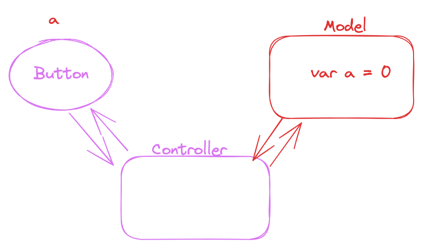
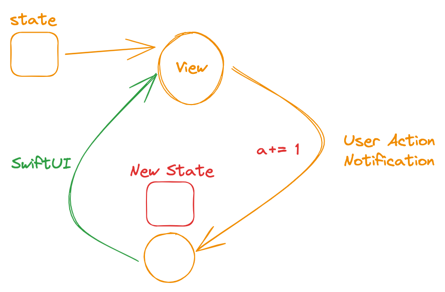

# SwiftUI - Основни

SwiftUI e новият начин за реализиране на приложения в еко системата на Apple. Няма да се спираме детайлно на всички плюсове на фреймуорка в тази лекция, а ще се опитаме да разгледаме начина и на функциониране, спрямо класическия модел.

Най-напред ще разясним популярния модел за програмиране - императивния, базиран на събитията.

## Класически модел - базиран на събитията

Това е модел, в който ролята на програмиста е по-голяма. Той се грижи за всичко от край до край. За целта ще разгледаме най-популярната архитектура използване преди SwiftUI, за изграждане на мобилни приложения. 
> Не всички мобилни приложения я следват, но тя е като основа. Съществуват подобрения (други архитектури), които могат да се ползват при реализирането на мобилни приложения.

Обект на изследване е `Model View Controller` още известна като `MVC`. Ще бъде детайлно разгледана в следващата лекция. Можем да илюстрираме елементарно приложение, което има един бутон за комуникация от страна на потребителя и свое състояние (`model`), който трябва да е в синхрон.



На кратко, контролерът е най-обемния елемент от тази система. Той е отговорен за координацията между изгледа (View) и състоянието (Model). Разработчикът трябва да прилага микро мениджмънт над всеки компонент. Да го разполага правилно на екрана, да го инициализира със данни, да следи за неговото състояние. Аналогично, трябва да отговаря за състоянието. Да отразява действията на потребителя върху модела. И всичките тези действия се реализират с код. Колкото повече код, толкова повече възможност за бъгове и грешки. 
> При UIKit проектите за iOS е нещо характерно да има огромни контролери, които да правят много неща и голямо количество от проблемите се крие в тях.  
  

## Нов модел - базиран на данните(състоянието)

`SwiftUI` е фреймуорк, който въвежда новата парадигма за състоянието. Всяко View (градивен елемент на SwiftUI проект) се състои от състояние и от `body` - изчислимо пропърти, което съдържа `рецепта`, която е функция на състоянието. Т.е. в зависимост какво е състоянието, view-то изглежда по различен начин. Няма явен контролер, който да отговаря за координацията на всички елементи.
`SwiftUI` отговаря за изобразяването на "рецептата" в зависимост от текущото състояние. При действия от потребителя или външни събития се променя състоянието. После `SwiftUI` поема контрола, изчислява как трябва да изглежда компонента и ако има различия от текущия вариант се отразяват необходимите визуални промени.   



## View Hierarchy

Композицията е добре известния шаблон, които се използва за реализирането на SwiftUI йерархията (и не само тази, добре познатия DOM в browser-а също ползва композиция). Композирането позволява да вграждаме view-та в други вюта, които имат ролята на контейнери. Т.е. те могат да съхраняват и управялват повече от едно вю (изглед). Ето пример:
Ако имаме екран за логин, то той от своя страна ще съдържа два компонента за въвеждане на потребителско име и парола и един бутон `Login`. Всеки от компоненти за въвеждане на текст от своя страна може да съдържа заглавие, примерен текст и поле в което да се въвежда текста.
Композирането на изгледи и разделянето на сложни изгледи на няколко прости (и повтарящи се) е основна техника, която позволява преизползването на компоненти. Това води до по-прегледни програми и по-лесни за поддържане. 

## View Live Cycle

Трябва да отбележим, че `SwiftUI` извиква `body` пропъртито първоначално и после при всяка промяна на състоянието на съответното view. Т.е. имаме едно непрестанно преизчисляване и сравянване, какво трябва да се изобрази на екрана.

> Swift View-тата за малки компоненти, които се създават и унищожават многократно. Те са описатели на това, което трябва да бъде изобразено на екрана. Как точно то става остава част от имплементацията на `SwiftUI`. 

## Overlay

> За модификаторите може да прочете малко по-късно в тази лекция.

С модифкатора `overlay` можем да поставяме елементи върху вече съществуващ компонент. Това ни позволява да позиционираме различни други компоненти в дълбочина.

> Ще разгледаме `ZStack` компонента, който предоставя подобна функционалност.


## Основни view елементи 

Ето и няколко от основните компоненти, с които можем да работим, когато създаваме нашите приложения. Списъкът не е изчерпателен.

Button
Slider
Stepper
Spacer 
Containers
Canvas/Graphics

## Модификатори

Модификаторите позволяват да прилагаме различни конфигурации към текущите view-та.

Част от модификаторите нямат определен ред. Т.е. можем спокойно да ги разместваме и крайният визуален резултат ще е един и същ. 

> Модификаторите, които променят позицията и размерът имат конкретен ефект върху крайния резултат.

> Можем да използваме библиотеката (+ бутона горе в дясно на Xcode) и нейният режим за избор на модификаторите. Това ще ни позволи по-лесно да намираме тези модификатори, които са съществени при имплементирането на `SwiftUI` код. 

> Определени модификатори (нека да ги наричаме по-общи като `padding()`) променят типът на връщания елемент(резултат), което прави невъзможно прилагането на по-конкретен модификатор след по-общ.

Ето и един пример:

```swift

```

Следния пример не се компилира: 


```swift
struct MyLabel {
    var body: some View {
        Text("Text")
            .padding()
            .bold()
    }
}
```


https://www.swiftbysundell.com/questions/swiftui-modifier-order/
