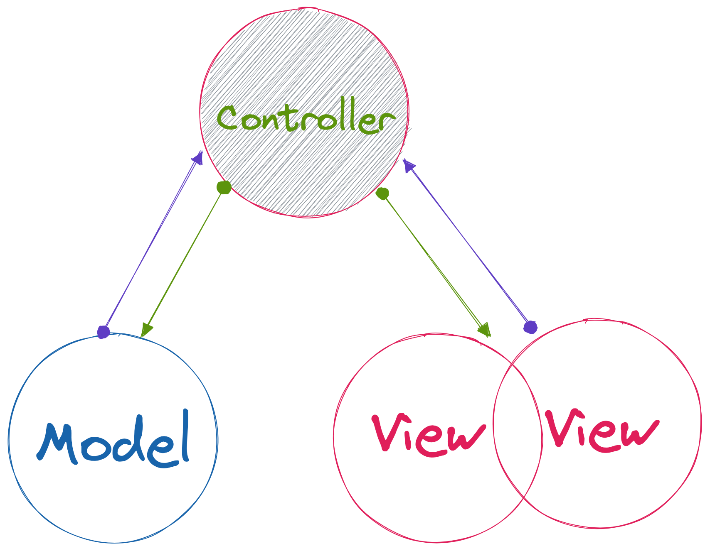
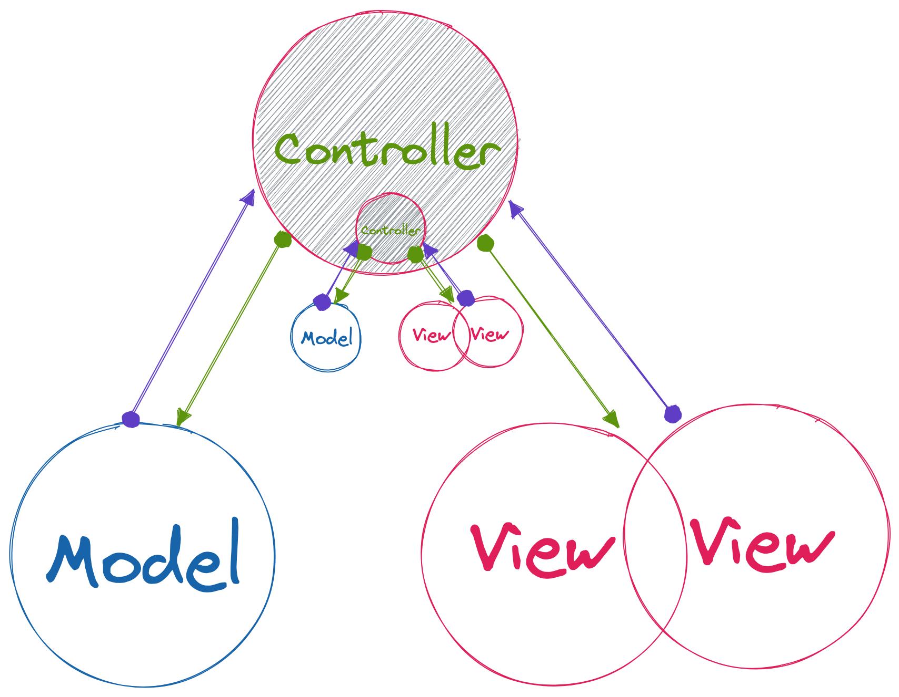

# Design Patterns
Какво са шаблоните (Design Patterns) в програмирането?    

> Добре известни решения (можем да смятаме за оптимални) на стандартни проблеми.

Програмистите използват шаблоните, за да наименоват конкретни похвати, които решават известни проблеми по правилен начин. С тези шаблони, много по-лесно можем да комуникираме идеи и решения. 

Днес, ще се запознаем различничните видове шаблони, като ще разгледаме в детайли само част от тях. Има книги и материали (сайтове, видео уроци, статии), които разглеждат всички конкретни видове шаблони. 

В основата като най-препоръчвана книга може да разгледате [Design Patterns: Elements of Reusable Object-Oriented Software](https://springframework.guru/gang-of-four-design-patterns/) - или още известна като [The Gang Of Four](https://books.google.bg/books/about/Design_Patterns.html?id=6oHuKQe3TjQC&printsec=frontcover&source=kp_read_button&hl=en&redir_esc=y#v=onepage&q&f=false).

Част от позитивните страни на преизпозлваемите решения в програмирането при дизайн и разработката на софтуер са:
* Кодът е по-лесен за четене
* Кодът е преизползваем.
* Кодът е **loosely coupled** (без излични зависимости) - т.е. лесно можем да подменяме и добавяме части, без регресии.

Ето и шаблоните разделени в различни категории:

* Структурни/Structural - Delegation, Cоmposite, Decorator
    > Шаблони, които позволяват по-лесно структуриране на кода, така че при промяна да не се налага промяна на всички части. С тях лесно може да се изграждат големи структури, по елегантен и устойчив начин.
* Създаващи/Creational - Dependency injection, Singleton, Factory, Prototype, Builder
    > Шаблони, които подобряват инстанцирането на конкретни типове данни. Те подобравят процесът на създаване, като го правят по динамичен и адаптивен - като предоставят контрол над това какво се зъдава, как и по какъв начин.
* Поведенчески/Behavioral - Chain of responsibility, Memento, Observer, Protocol stack, Visitor
    > Шаблони, които подобравят разделението между задълженията в типовете данни и начина по който те си взаимодействат. Тези шаблони въвеждат допълнително ниво на абстракция, което позволява по-лесно да се прилагат различни алгоритми, действия и поведение над всички участниците в софтуерната система.
* Архитектурни/Architectural - MVC, MVVM, MVP, MVA, Client-Server
    > Шаблони, които подобряват организацията на софтуерната система. Полезни са, когато системата започва да расте и минава над определени размери - брой редове код и сложност на взаимодействията между различните подсистеми.
* Функционални*/Functional* - Closure, Currying, Functor, Monad
    > Шаблони, които се прилагат при функционалното програмиране, но могат да бъдат ползвани и в класическото (императивното).

Повече информация за шаблоните може да намерите на следния [сайт](https://refactoring.guru/design-patterns/swift) (тук е секцията за Swift).

Преди да се запознаем с основния шаблон, който се предпочита в момента при изграждането на по-големи приложения за iOS със SwiftUI, ще трябва да се запознаем в детайли с първообраза му - MVC - Model View Controller.

# Какво е MVC?
Това е архитектурния шаблон Model-View-Controller. Той е в основата на Cocoa и UIKit. Върши много добра работа при организирането на проекти, които не са твърде огромни по големина. Т.е. идеален кандидат за малки и средни проекти. 

Основните предимства, които получаваме, когато го ползваме са: 
- отделяме данните - това е Model (моделa). Това можем да считаме за ядрото на проекта. Често данните се считат за основа на модела на една софтуерна система.
- отделяме потребителския интерфейс - View - това е подредбата на визуалните елементи, анимации, компоненти, които комуникират директно с потребителя. Самите визуални елементи трябва да са абстрактни и да не зависят от конкретните данни. По сложни компнените се изграждат, чрез композиране на няколко прости. Потребителския интерфейс е управяляван от контролера.
> Примерно: Login View - трябва да включва няколко текстови полета за изобразяване да текст, няколко за въвеждане на потребителско име и парола и бутон за активиране.
-  създаваме междинен слой, който е посредник между модела и потребителския интерфейс. Този нов слой е медиатор, които интерпретира, форматира и подготвя данните за визуализация. В него живее и бизнес логиката и действията, които рефлектират, как ще се промени изгледа при някаква промяна - било тя в модела или от потребителя.

Основните правила, които трябва да спазваме при изграждането на комуникацията при MVC са:

### Контролер -> Модел
* Неограничена комуникация
* Неговата задача е да представи данните от модела

### Контролер -> Изглед
* `IBOutlet` (в UIKit) променливи за отделните елементи, които искаме императивно да командваме. 
    > Примерно: `UIButton`, който искаме са скрием или да покажем с анимация.     
* Предаваме на изгледа какво и как да го покаже

### Комуникация между Изглед <-> Модел е *ЗАБРАНЕНА* !
* Моделът е __НАПЪЛНО__ независим от потребителкия интерфейс
* Изгледа __Е__ потребителския интерфейс

### Изглед -> Контролер
* "Сляпа и структурирана" комуникация, Изгледа е абстрактен
* `IBAction` (Target-action) (в UIKit)
* При нужда от синхронизация между Изгледа и Контролера - делегираме (напр. `UIScrollViewDelegate` или други делегати, които позволяват по-добър контрол)
* Изгледа не притежава данните, затова - питаме за тях Контролера, които трябва да представим - `dataSource` (напр. `UITableViewDataSource`)
* `Delegate` и `DataSource` се реализират с __протоколи__

### Модел -> Контролер
* Няма директна комуникация
* При промяна в данните, Моделът може да уведоми Контролера чрез нотификация и той ги поисква от Модела
* Може да се разгледа като "радио предаване" - Модела предава, Контролера слуша
за промени, които да бъдат отразени в изгледа

> Често, MVC отговаря за един екран. В едно по-голямо приложение имаме повече от едно MVC и те си общуват по позволените канали за комуникация. Можем спокойно да композираме различни MVC-та.

# MVVM
* Model-View-ViewModel (-Binding*)
* Архитектурен шаблон
* [Джон Госман 2005](https://blogs.msdn.microsoft.com/johngossman/2005/10/08/introduction-to-modelviewviewmodel-pattern-for-building-wpf-apps), Майкрософт, WPF

### Изместваме състоянието и управлението му от View-то към ViewModel

## Изглед - View
* Потребителският интерфейс - подредба на визуалните елементи, инициализацията им, анимации и др.

## ViewModel
* Слой между Изгледа и Модела
* Предоставя набор от интерфейси, всеки от които представлява визуален компонент от Изгледа
* Използваме Обвързване (Binding), за да свържем визуалните компоненти с тези интерфейси
* т.е. **НЕ** достъпваме Изгледа директно, а при промени от бизнес логиката, Изгледа сам се обновява
* Обработката и форматирането на данните, която се случваше в Контролера при MVC, е задача на ViewModel

### Предимства
* Енкапсулираната логика във ViewModel позволява по-лесното изолирано тестване

### Недостатъци
* Самият Джон Госман  изтъква, че времето за имплементация и усилията са "излишни" за прости операции с потребителския интерфейс.
* За по-големи приложения става по-трудно генерализирането на ViewModel и е възможно използването на значително повече памет

# Delegation

Делегирането е начин на композиция, също толкова добра за преизползването на код, както и Наследяването.
При делегирането в обработката на заявка участват два обекта: приемащият обект делегира операции на своя **делегат**. 
Това е аналогично на наследниците, използващи имплементацията на функционалност на бащиния клас.

    1. MVVM, MVC
    1. Delegate,
    1. Observer - KVO
    1. Singleton
    1. Combine

# Data flow in SwiftUI

    1. @State
    1. @StateObject
    1. @EnvironmentObject
    1. @ObservableObject
    1. @ObservedObject