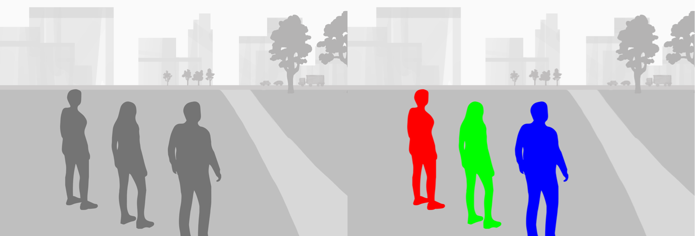
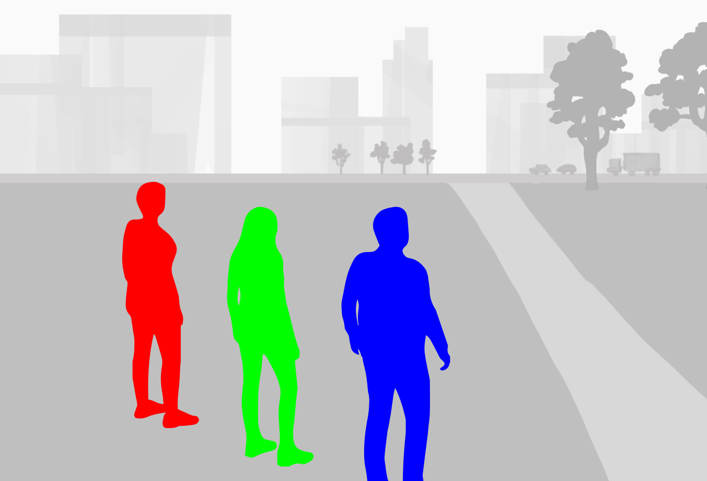
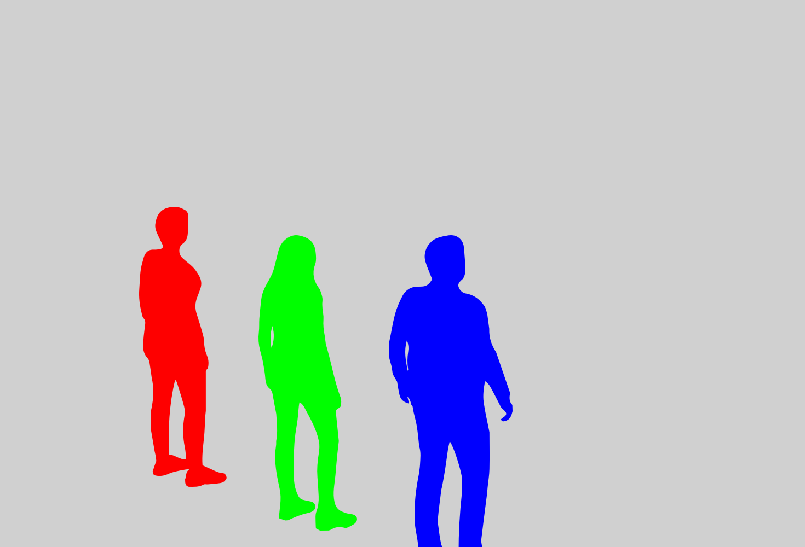
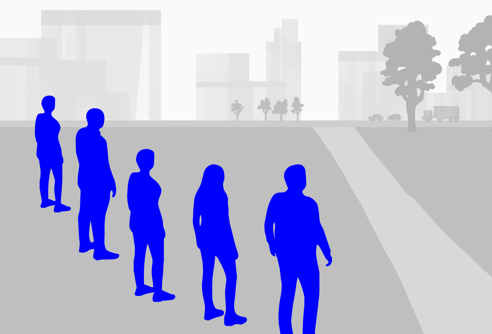
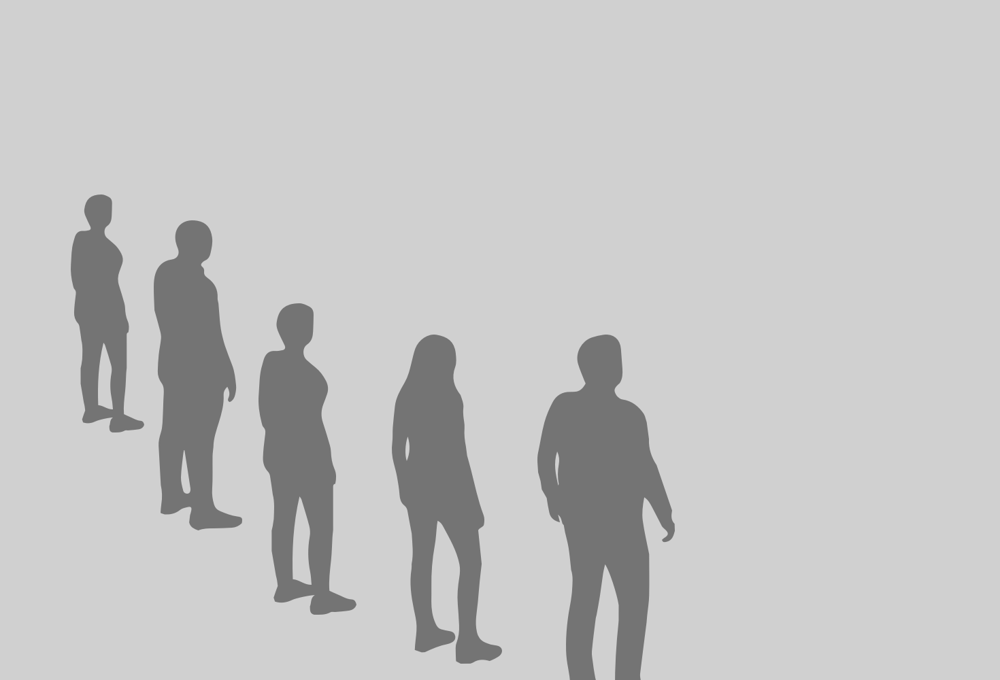

# Segmenting and colorizing individuals from a surrounding scene 

Пример, който е взет от документацията на Apple.
[VisionKit](https://developer.apple.com/documentation/VisionKit)
[VisionKit](https://developer.apple.com/documentation/visionkit/imageanalysisinteraction)
[Vision](https://developer.apple.com/documentation/vision)
[Видео](https://developer.apple.com/videos/play/wwdc2023/10176/)
[Видео](https://developer.apple.com/videos/play/wwdc2023/10048/)
[StackOverFlow](https://stackoverflow.com/questions/74411529/imageanalysisinteraction-in-uiviewrepresentable-not-working-correctly)


Примерът е разширен на базата на [статията](https://h76joker.medium.com/lift-subjects-from-images-in-your-app-d7fb8d366cda) и кода в github репото към статията.

Use the Vision framework to isolate and apply colors to people in an image.

## Overview

Segmenting individuals in photos is a powerful tool that can provide more creative control for people using your app. Person segmentation enables you to provide popular features like personalized effects and filters, background replacement, and enabling photographic corrections. 

This sample shows you how to generate segmented masks for up to four individuals in a scene. This sample generates one mask for everyone if more than four individuals are in the scene. Individuals in each mask are then colorized. You can then select the individuals you want to segment and colorize.



## Configure the sample code project

To run this sample app, you need an iPhone or iPad with iOS 17 or iPadOS 17, respectively, or later. 
You need to run this sample code project on a physical device.

## Determine the number of faces in a scene

The sample first determines the number of faces in the scene given the [`CIImage`][0] using [`VNDetectFaceRectanglesRequest`][1]. 

``` swift
// Returns the number of people in the image.
private func countFaces(image: CIImage) async -> Int {
    // Approximate the number of people in the image.
    let request = VNDetectFaceRectanglesRequest()
    let requestHandler = VNImageRequestHandler(ciImage: image)
    do {
        try requestHandler.perform([request])
        if let results = request.results {
            return results.count
        }
    } catch {
        print("Unable to perform face detection: \(error).")
    }
    return 0
}
```

The number of faces determines the segmentation approach:
* If there are four or fewer faces, the sample uses [`VNGeneratePersonInstanceMaskRequest`][2].
* If more than four faces are detected, the sample uses [`VNGeneratePersonSegmentationRequest`][3], and produces a mask for all the individuals in the image.

``` swift
let numFaces = await countFaces(image: image)
if numFaces <= 4 {
    request = VNGeneratePersonInstanceMaskRequest()
} else {
    request = VNGeneratePersonSegmentationRequest()
}
```

## Generate the segmented masks

The sample sets up the image analysis requests for the image with [`VNImageRequestHandler`][4] and processes the request for the image. The [`perform(_:)`][5] method schedules the request. When the request completes, the segments are returned in `request.results`.

``` swift
// Set up and run the request.
let requestHandler = VNImageRequestHandler(ciImage: image)
self.baseImage = image
do {
    try requestHandler.perform([request])
    
    // Get the segmentation results from the request.
    switch request.results?.first {
    case let buffer as VNPixelBufferObservation:
        segmentationResults = PersonSegmentationResults(results: buffer)
        selectedSegments = [1]
    case let instanceMask as VNInstanceMaskObservation:
        segmentationResults = InstanceMaskResults(results: instanceMask, requestHandler: requestHandler)
        selectedSegments = instanceMask.allInstances
    default:
        break
    }
```

If there are more than four faces, the sample produces a matte image for the individual segments in the image, the resulting mask is an instance of [`VNPixelBufferObservation`][7]. If there are four of fewer faces, the resulting mask is an instance of [`VNInstanceMaskObservation`][8].

The sample then updates the image on the main thread with the colorized mask.

``` swift
let segmentedImage = await segmentationResults?.generateSegmentedImage(baseImage: image, selectedSegments: selectedSegments)

Task { @MainActor in
    // Update the UI.
    if let results = segmentationResults {
        self.segmentationCount = results.numSegments
    }
    self.segmentedImage = segmentedImage ?? UIImage(cgImage: CIContext().createCGImage(image, from: image.extent)!)
    self.showWarning = segmentationResults is PersonSegmentationResults
}
```

- Note: Perform UI updates on the main thread. Updating the UI on other threads can lead to unstable behavior and hangs. 

## Colorize individual people in an image

The sample's `InstanceMaskResults` class generates segmented images for up to four people in a scene. It conforms to the `SegmentationResults` protocol. The sample initializes the class with the [`VNInstanceMaskObservation`][8] results and a [`VNImageRequestHandler`][4].

The `generateSegmentedImage` method synchronously generates an image with the selected segments highlighted. It scales the masks for each segment and blends them with the base image using specified colors.

``` swift
for index in selectedSegments {
    do {
        let maskPixelBuffer = try instanceMasks.generateScaledMaskForImage(forInstances: [index], from: requestHandler)
        let maskImage = CIImage(cvPixelBuffer: maskPixelBuffer)
        image = blendImageWithMask(image: image, mask: maskImage, color: SegmentationModel.colors[index])
    } catch {
        print("Error generating mask: \(error).")
    }
}
```

The following illustration depicts the colorization when the person using this sample selects two segmentations when there are up to four people in the image. The sample masks three of the people with different, selected colors.


If the person using this sample selects all the people and the background of the image, this sample masks the background with the selected color, and masks and colorizes the people.


## Colorize more than four people in an image

The sample's `PersonSegmentationResults` class generates a segmented image for every person in a scene using [`VNPixelBufferObservation`][7] from [`VNGeneratePersonSegmentationRequest`][3]. It conforms to the `SegmentationResults` protocol. The sample's `generateSegmentedImage` method generates the image with a mask for the foreground or the background.

If there are more than four people in the image and the person using this sample selects the mask in the foreground, `blendImageWithMask(image, mask)` applies a masks to all the detected individuals with a specific color.

``` swift
if selectedSegments.contains(1) {
    // Foreground is selected.
    segmentedImage = blendImageWithMask(image: baseImage, mask: maskImage, color: SegmentationModel.colors[1])
}
```



If the person using the sample selects the background mask in the image, the sample masks the background of the image with a specific color, but leaves the people in the foreground of the image intact. This allows for selectively coloring the background of the image based on the segmentation mask.
 
``` swift
if selectedSegments.contains(0) {
    // Background is selected.
    let blendFilter = CIFilter.blendWithMask()
    blendFilter.inputImage = baseImage
    blendFilter.backgroundImage = CIImage(color: CIColor(color: SegmentationModel.colors[0])).cropped(to: baseImage.extent)
    blendFilter.maskImage = maskImage
    segmentedImage = blendFilter.outputImage!
}
```



[0]: https://developer.apple.com/documentation/coreimage/ciimage
[1]: https://developer.apple.com/documentation/vision/vndetectfacerectanglesrequest
[2]: https://developer.apple.com/documentation/vision/vngeneratepersoninstancemaskrequest
[3]: https://developer.apple.com/documentation/vision/vngeneratepersonsegmentationrequest
[4]: https://developer.apple.com/documentation/vision/vnimagerequesthandler
[5]: https://developer.apple.com/documentation/vision/vnimagerequesthandler/perform(_:)
[7]: https://developer.apple.com/documentation/vision/vnpixelbufferobservation
[8]: https://developer.apple.com/documentation/vision/vninstancemaskobservation

